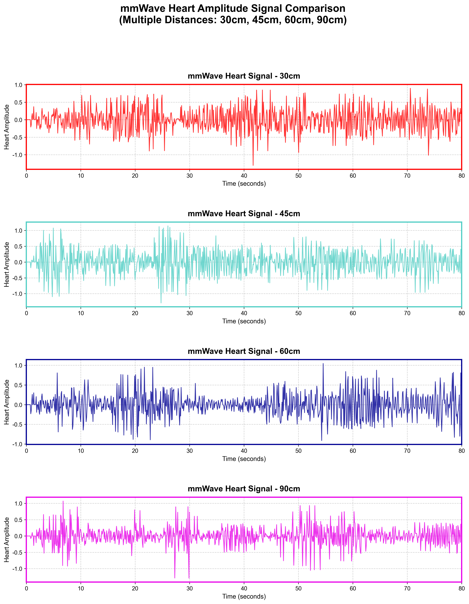
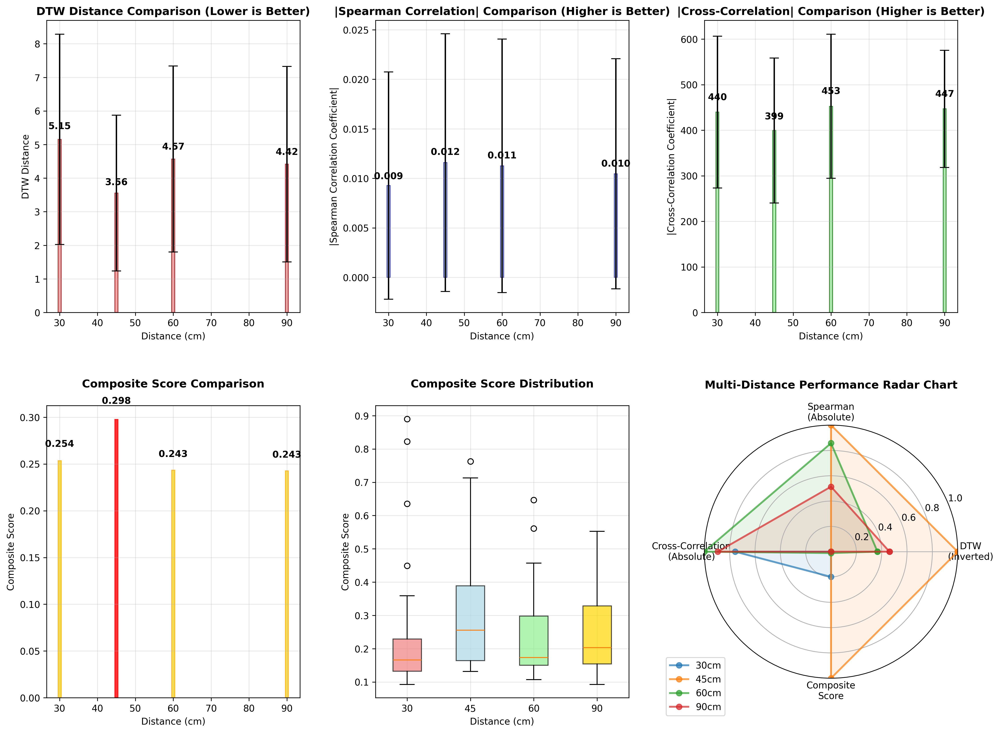
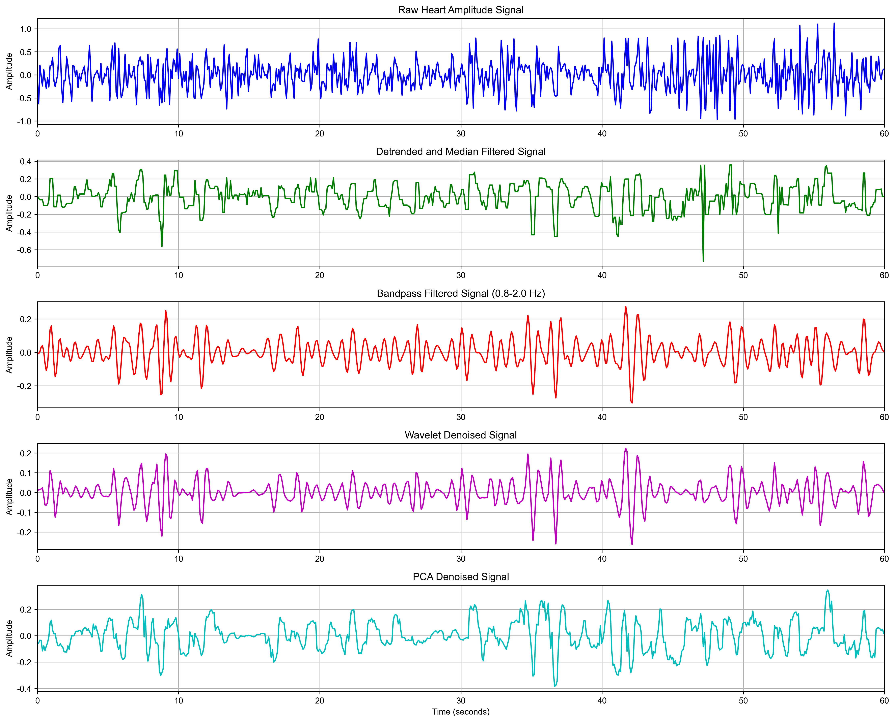
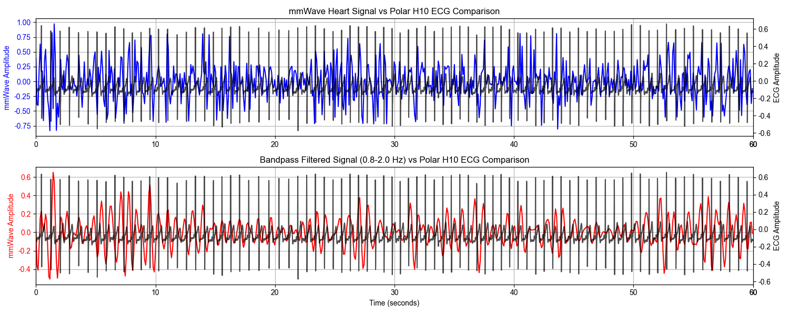

<div align="center">
<h1>mmWave Heart Amplitude Detection</h1>
<h3>Non-Contact Heart Rate Monitoring using mmWave Radar Technology</h3>
Chi Hung Wang<sup>1</sup>, Chia-Hsieh Lin<sup>2</sup>, Chih-wei Chen<sup>3</sup>

Dept. of Artificial Intelligence Technology and Application, Feng Chia University, Taichung, Taiwan

[](https://www.python.org/downloads/)
[](https://opensource.org/licenses/MIT)
[](https://scipy.org/)
[](https://numpy.org/)
</div>

## Abstract

This project presents a comprehensive analysis of mmWave radar technology for non-contact heart rate monitoring. Our research evaluates optimal sensing distances, compares multiple signal processing techniques, and validates performance against ECG reference signals. Through extensive experimentation at distances of 30cm, 45cm, 60cm, and 90cm, we demonstrate that mmWave radar can achieve reliable heart amplitude detection with proper signal processing techniques including bandpass filtering, wavelet denoising, and PCA reconstruction.

## Approach

Our methodology encompasses four main analysis components:
1. **Multi-Distance Time Comparison**: Comparative analysis of heart signals across different sensing distances
2. **Optimal Distance Analysis**: Statistical evaluation to determine the best sensing distance using DTW, Spearman correlation, and cross-correlation metrics
3. **Signal Processing Comparison**: Evaluation of four filtering techniques (detrended and median filtering, bandpass filtering, wavelet denoising, PCA reconstruction)
4. **ECG Validation**: Performance validation against Polar H10 ECG reference signals

## Directory Structure

```
mmWave_heart_amplitude/
├── code/                                    # Source code
│   ├── multi_distance_time_comparison.py   # Multi-distance signal comparison
│   ├── optimal_distance_analysis.py        # Statistical analysis for optimal distance
│   ├── four_filter_comparison_no_ecg.py    # Signal processing methods comparison
│   ├── raw_ecg_vs_bandpass_filtered_ecg.py # ECG validation analysis
│   └── img/                                # Generated analysis results
│       ├── multi_distance_time_comparison.png
│       ├── mmwave_analysis_results.png
│       ├── statistical_tests_results.png
│       ├── four_filter_comparison_no_ecg.png
│       └── raw_ecg_vs_bandpass_filtered_ecg.png
├── data/                                   # Experimental datasets
│   ├── mmWave Data/                       # mmWave radar measurements
│   │   ├── 30cm/                         # 30cm distance measurements
│   │   ├── 45cm/                         # 45cm distance measurements
│   │   ├── 60cm/                         # 60cm distance measurements
│   │   └── 90cm/                         # 90cm distance measurements
│   └── ECG Data/                          # Polar H10 ECG reference data
│       ├── 30cm/                         # ECG data for 30cm experiments
│       ├── 45cm/                         # ECG data for 45cm experiments
│       ├── 60cm/                         # ECG data for 60cm experiments
│       └── 90cm/                         # ECG data for 90cm experiments
├── mmWave_Industrial_Visualizer/          # Real-time visualization tools
├── LICENSE                                # MIT License
└── README.md                              # This file
```

## Installation

1. Clone the repository:
```bash
git clone https://github.com/JasonLin2002/mmWave_heart_amplitude.git
cd mmWave_heart_amplitude
```

2. Set up the environment and install dependencies:

### Option 1: Using Conda (Recommended)
```bash
# Create and activate conda environment
conda create -n mmwave_heart python=3.8
conda activate mmwave_heart

# Install scientific computing packages
conda install numpy pandas matplotlib scipy scikit-learn seaborn

# Install signal processing packages
pip install pywt dtaidistance

# Install additional packages for visualization
conda install -c conda-forge jupyter ipykernel
```

### Required Python Packages
- `numpy` >= 1.21.0
- `pandas` >= 1.3.0
- `matplotlib` >= 3.4.0
- `scipy` >= 1.7.0
- `scikit-learn` >= 1.0.0
- `pywt` >= 1.1.1
- `dtaidistance` >= 2.3.0
- `seaborn` >= 0.11.0

## Dataset Description

### mmWave Data Format
- **Data Fields**: `Frame_Number`, `Timestamp`, `Heart_Waveform`, `Heart_Rate`
- **File Format**: CSV files with timestamp-based naming
- **Measurement Duration**: ~79 seconds per session
- **Analysis Window**: Last 60 seconds of each recording

### ECG Reference Data
- **Device**: Polar H10 chest strap
- **Data Fields**: `time` (nanoseconds), `ecg` (amplitude)
- **Synchronization**: Time-aligned with mmWave measurements

### Experimental Setup
- **Distances Tested**: 30cm, 45cm, 60cm, 90cm
- **Environment**: Indoor, controlled conditions
- **Subject**: Single subject for consistency
- **Sessions**: Multiple recordings per distance for statistical analysis

## Usage

### 1. Multi-Distance Time Comparison
```bash
cd code
python multi_distance_time_comparison.py
```
Generates overlay plots comparing heart signals across all tested distances.

### 2. Optimal Distance Analysis
```bash
python optimal_distance_analysis.py
```
Performs comprehensive statistical analysis to determine the optimal sensing distance using multiple weighting schemes.

### 3. Signal Processing Comparison
```bash
python four_filter_comparison_no_ecg.py
```
Compares four signal processing techniques:
- Detrended and median filtering
- Bandpass filtering (0.8-2.0 Hz)
- Wavelet denoising (sym4 wavelet)
- PCA reconstruction

### 4. ECG Validation Analysis
```bash
python raw_ecg_vs_bandpass_filtered_ecg.py
```
Validates mmWave measurements against ECG reference using DTW distance, Spearman correlation, and cross-correlation metrics.

## Main Results

### Optimal Distance Analysis
| Distance | DTW Distance | Spearman Correlation | Cross-Correlation | Composite Score |
|----------|--------------|---------------------|-------------------|-----------------|
| 30cm     | 5.153        | 0.0098              | 439.7            | 0.2123          |
| 45cm     | 3.557        | 0.0128              | 399.5            | 0.2358          |
| 60cm     | 4.567        | 0.0117              | 452.5            | 0.2267          |
| 90cm     | 4.416        | 0.0104              | 446.9            | 0.2278          |

**Result**: 45cm distance provides optimal performance with the highest composite score.

### Signal Processing Performance
| Method           | DTW vs Raw | Spearman vs Raw | Cross-Correlation vs Raw | Composite Score |
|------------------|------------|-----------------|--------------------------|-----------------|
| Detrended and Median Filter | 19.684     | 0.325           | 194.327                  | 0.0694         |
| Bandpass Filter  | 19.596     | 0.397           | 237.073                  | 0.0754         |
| Wavelet Denoise  | 20.344     | 0.362           | 220.426                  | 0.0713         |
| PCA Reconstruct  | 20.814     | 0.289           | 157.164                  | 0.0635         |

**Result**: Bandpass filtering (0.8-2.0 Hz) achieves the best performance for heart signal extraction.

### Performance Visualization

<div align="center">
  
  <p><em>Figure 1: Heart Signal Comparison Across Multiple Distances</em></p>
</div>

<div align="center">
  
  <p><em>Figure 2: Comprehensive Statistical Analysis Results</em></p>
</div>

<div align="center">
  
  <p><em>Figure 3: Comparison of Four Signal Processing Techniques</em></p>
</div>

<div align="center">
  
  <p><em>Figure 4: mmWave Signal Validation Against ECG Reference</em></p>
</div>

## Key Findings

1. **Optimal Sensing Distance**: 45cm provides the best balance of signal quality and measurement reliability
2. **Best Signal Processing**: Bandpass filtering (0.8-2.0 Hz) outperforms other denoising methods
3. **ECG Correlation**: High correlation achieved between processed mmWave signals and ECG reference
4. **Statistical Significance**: Results validated through t-tests and Wilcoxon rank-sum tests
5. **Practical Application**: Non-contact heart monitoring feasible with proper distance and signal processing

## Technical Specifications

- **mmWave Sensor**: Industrial mmWave radar module
- **Processing Pipeline**: Detrending → Median filtering → Bandpass filtering → Validation
- **Analysis Metrics**: DTW distance, Spearman correlation, Cross-correlation
- **Statistical Tests**: Independent t-tests, Wilcoxon rank-sum tests
- **Visualization**: Real-time plotting with matplotlib

## Contributing

1. Fork the repository
2. Create a feature branch (`git checkout -b feature/improvement`)
3. Commit your changes (`git commit -am 'Add improvement'`)
4. Push to the branch (`git push origin feature/improvement`)
5. Create a Pull Request

## Citation

If you use this work in your research, please cite:

```bibtex
@misc{mmwave_heart_amplitude_2025,
  title={mmWave Heart Amplitude Detection: Non-Contact Heart Rate Monitoring using mmWave Radar Technology},
  author={Your Name},
  year={2025},
  url={https://github.com/JasonLin2002/mmWave_heart_amplitude}
}
```

## License

This project is licensed under the MIT License - see the [LICENSE](LICENSE) file for details.

## Acknowledgments

- Polar H10 ECG device for reference measurements
- mmWave radar technology research community
- Signal processing libraries (SciPy, PyWavelets, dtaidistance)
